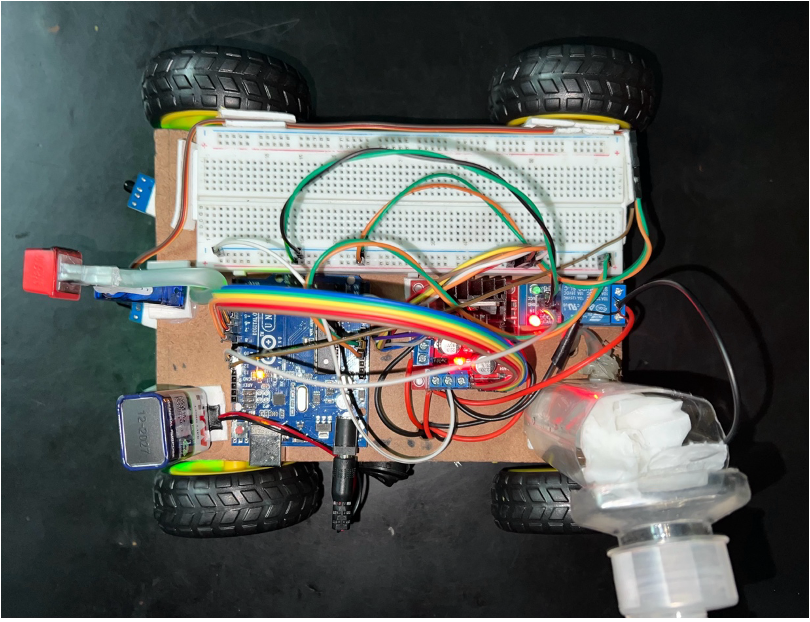
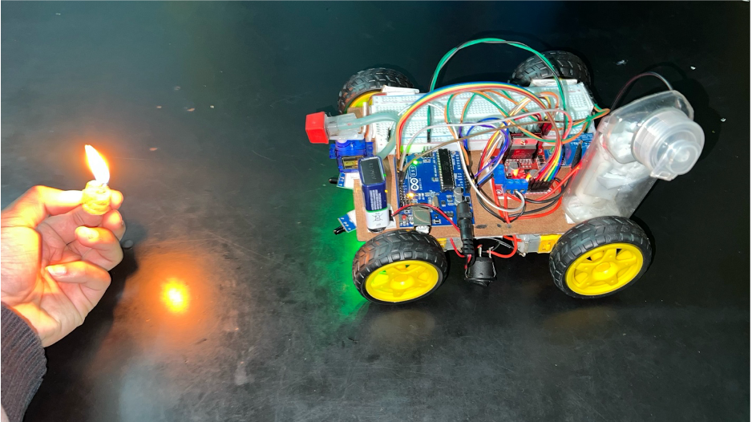
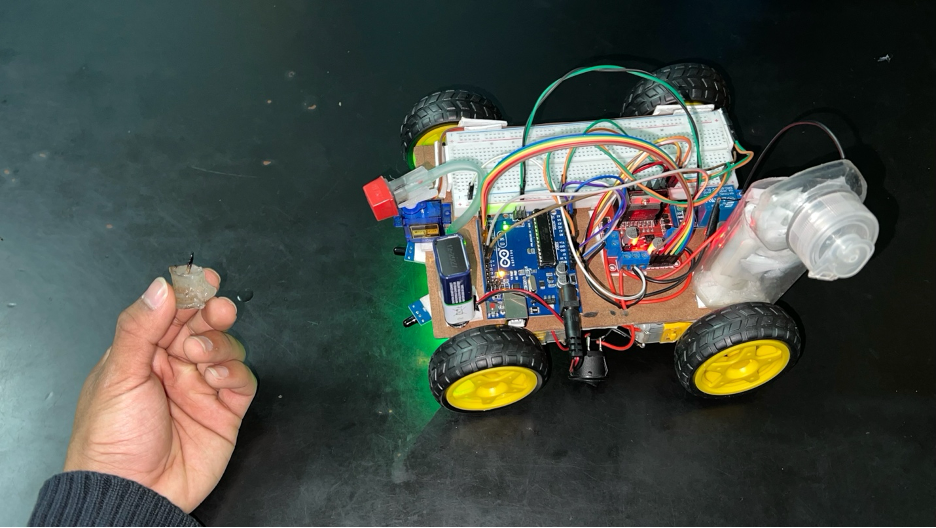
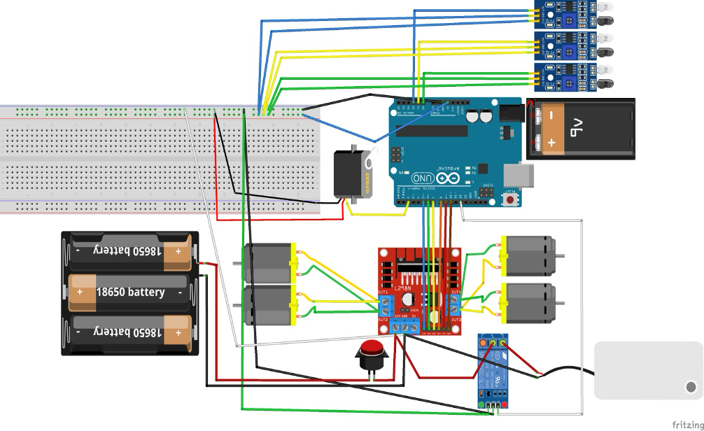

# Autonomous FireFighting Vehicle

An IoT-based robotic vehicle designed to detect and extinguish fire without human help. Ideal for areas with limited fire response access like forests or rural regions.

---

## Project Screenshots

---

## Features

- Flame detection using sensors
- Autonomous navigation using BO motors
- Water spraying via pump and servo
- Arduino-based control system
- Safe, fast, and efficient fire response

---

## How It Works

1. **Flame sensors** detect fire and send data to **Arduino**.
2. Vehicle navigates toward the fire using **motor driver + BO motors**.
3. **Water pump and servo** spray water until fire is extinguished.

---

## Components

- Arduino UNO
- 3x Flame Sensors
- 4x BO Motors + L298N
- Water Pump + Servo Motor
- Relay Module, Pipe, Chassis, Battery

---

## Circuit Diagram

